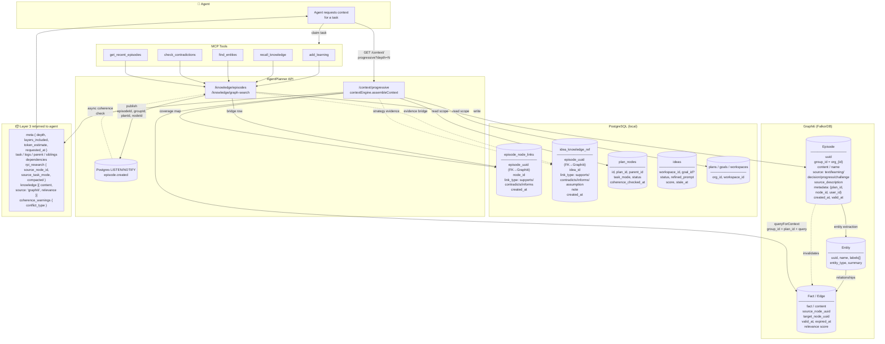

# Knowledge Layer Metadata

How AgentPlanner stores knowledge so agents can use it as context.

Knowledge lives in two places: **Graphiti** (temporal knowledge graph, backed by FalkorDB) holds episodes, entities, and facts; **PostgreSQL** holds thin bridge tables (`episode_node_links`, and for Strategy Memory `idea_knowledge_ref`) plus the planning tree. The **context engine** joins them at read time and returns a single bundle to the agent.

The product contract: knowledge is not "docs for agents". Knowledge is **evidence in the planning graph**. Tasks use it as execution context; Ideas use it as strategic evidence before a plan exists.

## Architecture



## Context engine flow

`contextEngine.assembleContext(nodeId, opts)` is the single read path. `opts`: `depth` (1–4, default 2), `token_budget` (0 = unlimited), `log_limit` (default 10), `include_research` (default true), `orgId`.

```mermaid
sequenceDiagram
    autonumber
    participant A as Agent
    participant API as GET /context/<br/>progressive
    participant CE as contextEngine.<br/>assembleContext
    participant DAL as PostgreSQL DAL
    participant G as graphitiBridge
    participant TB as trimToTokenBudget

    A->>API: nodeId, depth, token_budget
    API->>CE: assembleContext(nodeId, opts)

    rect rgb(20, 60, 90)
    Note over CE,DAL: Layer 1 — Task focus
    CE->>DAL: nodesDal.findById(nodeId)
    CE->>DAL: logsDal.listByNode(nodeId, log_limit)
    alt task_mode === 'implement' && include_research
        CE->>DAL: getChildren(parent) → find research/plan siblings
        CE->>DAL: prefer sibling.metadata.<br/>compacted_context.sections
        Note right of CE: fallback: logsDal.listByNode<br/>on each sibling
    end
    CE->>TB: trim after layer 1
    end

    alt depth >= 2
    rect rgb(20, 80, 60)
    Note over CE,DAL: Layer 2 — Local neighborhood
    CE->>DAL: nodesDal.findById(parentId)
    CE->>DAL: nodesDal.getChildren(parentId) → siblings
    CE->>DAL: dependenciesDal.listByNode(nodeId, 'both')
    CE->>TB: trim after layer 2
    end
    end

    alt depth >= 3
    rect rgb(60, 30, 90)
    Note over CE,G: Layer 3 — Knowledge
    CE->>G: isAvailable()?
    alt Graphiti up
        CE->>G: queryForContext(planId,<br/>[title, description], orgId)
        G-->>CE: [{ content, source: 'graphiti', relevance }]
    else Graphiti down
        Note right of CE: graceful degrade<br/>knowledge = []
    end
    CE->>TB: trim after layer 3
    end
    end

    alt depth === 4
    rect rgb(90, 60, 20)
    Note over CE,DAL: Layer 4 — Extended
    CE->>DAL: plansDal.findById(planId)
    CE->>DAL: ancestry loop:<br/>nodesDal.findById(parent...)
    CE->>DAL: goalsDal.getLinkedGoals('plan', planId)
    CE->>DAL: dependenciesDal.getUpstream(nodeId, 5)
    CE->>DAL: dependenciesDal.getDownstream(nodeId, 5)
    CE->>TB: final trim
    end
    end

    CE-->>API: { meta, task, logs, rpi_research?,<br/>parent, siblings, dependencies,<br/>knowledge, plan?, ancestry?,<br/>goals?, transitive_dependencies? }
    API-->>A: JSON bundle
```



**Key behaviors**

- **Layered, not all-or-nothing.** Each depth adds a slice. Agents pay for what they ask for.
- **RPI auto-injection.** When the task is in `implement` mode, sibling research/plan outputs are pulled in automatically — preferring the precomputed `compacted_context.sections` over raw logs.
- **Token budgeting.** `trimToTokenBudget` runs after each layer using a ~4 chars/token heuristic. It truncates array fields when the budget is exhausted and reports `token_estimate` + `budget_applied` in `meta`.
- **Graceful degradation.** If `graphitiBridge.isAvailable()` returns false, Layer 3 returns `[]` and the bundle is still served — plans and tasks still work, the agent just sees no facts.
- **Read-only.** The context engine performs no writes — no coherence-warning emission, no logging side effects.

## Metadata categories

### Identity / scoping

| Field | Where | Purpose |
| --- | --- | --- |
| `group_id` | Graphiti episode | Multi-tenant partition. Format `org_{org_id}` (also `user_{user_id}` / `default`). Every Graphiti call is namespaced by this. |
| `workspace_id` | app tables, episode `metadata` when available | Product/workspace scope. Strategy Memory uses this before an Idea is tied to a goal or plan. |
| `goal_id` | app tables, episode `metadata` when available | Strategic outcome scope. Used to recall knowledge before plan creation. |
| `idea_id` | `idea_knowledge_ref` | Strategy Memory evidence scope. Links an Idea to the episodes that support, contradict, inform, or frame it as a hypothesis. |
| `plan_id` | episode `metadata`, context query | Scopes retrieval to a planning tree. |
| `node_id` | episode `metadata`, `episode_node_links` | Anchors a learning to a specific task. |
| `org_id` | derived → `group_id` | Tenant isolation. |
| `user_id` | episode `metadata` | Authorship. |
| `episodeId` (uuid) | Graphiti-assigned | Primary key in the local `episode_node_links` bridge. |

### Knowledge scopes

Knowledge retrieval should be explicit about which product object is asking the question.

| Scope | Use case | Primary filters |
| --- | --- | --- |
| `org` | Cross-workspace memory, company-wide lessons, reusable constraints | `group_id = org_{org_id}` |
| `workspace` | Ideas that are not yet tied to a goal; workspace-level Strategy board | `group_id`, `workspace_id` |
| `goal` | Generate or refine strategic directions before a plan exists | `group_id`, `workspace_id`, `goal_id` |
| `idea` | Show evidence, assumptions, contradictions, and coverage for a strategic direction | `idea_knowledge_ref.idea_id` + Graphiti episode ids |
| `plan` | Plan-level context and coherence | `group_id`, `plan_id` |
| `node` / `task` | Execution context for a specific task | `episode_node_links.node_id`, `plan_id`, dependency neighborhood |

Execution flows should prefer `node`/`plan` context. Strategy flows should prefer `workspace`/`goal` recall first, then bind selected evidence to an `idea`.

### Temporal (bi-temporal)

| Field | Purpose |
| --- | --- |
| `created_at` | Wall-clock write time on the link row and the episode. |
| `valid_at` | When a fact became true (Graphiti). |
| `expired_at` | When a contradicting episode invalidated the fact. |
| `coherence_checked_at` | Plan/goal-level staleness clock — drives the "stale beliefs" warning (default 5-day threshold). |

### Source / provenance

| Field | Values |
| --- | --- |
| `source` | `text` \| `learning` \| `decision` \| `progress` \| `challenge` |
| `source_description` | Free-text origin label (default: `'AgentPlanner knowledge entry'`). |
| `entry_type` | Filter parameter on `recall_knowledge`. |
| `source_node_id` / `source_title` / `source_task_mode` | RPI chain trace (research → plan → implement). Lets an implement task find the upstream research it was built from. |

### Content

- `content` / `fact` / `text` — the knowledge text, normalized across Graphiti response shapes.
- `name` — optional human label.
- `metadata` (JSONB) — `plan_id`, `node_id`, `user_id`, `user_name`.
- Graphiti auto-extracts **entities** (`uuid`, `name`, `labels[]`, `entity_type`, `summary`) and the **edges** between them.

### Search / retrieval

- `query` — semantic search string passed to Graphiti.
- `max_results` / `max_facts` / `max_nodes` / `max_episodes` — pagination (10–20 default).
- `relevance` / `score` — surfaced alongside each fact in Layer 3 context.

### Linkage & contradictions

- `episode_node_links.link_type` — `supports` | `contradicts` | `informs`. Local bridge table that survived the removal of the flat `knowledge_entries` table; powers fast coverage queries without round-tripping Graphiti.
- `idea_knowledge_ref.link_type` — `supports` | `contradicts` | `informs` | `assumption`. Strategy Memory bridge table. It answers why an episode is attached to an Idea, not merely that it is attached.
- `contradictions_found`, `current` vs `superseded` — returned by `detectContradictions`.
- `fact.source_node_uuid` / `target_node_uuid` — Graphiti edge endpoints used to build coverage maps.

## Knowledge as evidence for Strategy Memory

Strategy Memory introduces Ideas: candidate directions between a Goal and a Plan. Ideas need knowledge before there is a task context, so they should not depend on `GET /context/progressive?nodeId=...`.

The canonical bridge is:

```sql
idea_knowledge_ref {
  idea_id
  episode_uuid      -- Graphiti episode uuid
  link_type         -- supports | contradicts | informs | assumption
  note              -- why this evidence is attached
  created_by
  created_at
}
```

`link_type` is product-critical:

- `supports` — evidence that strengthens the Idea.
- `contradicts` — evidence that challenges the Idea or its assumptions.
- `informs` — useful background that shapes the Idea but is not direct proof.
- `assumption` — a hypothesis explicitly recorded when no direct evidence exists.

This prevents the Strategy board from becoming a tag wall. Evidence chips in the UI should show the relationship, not just the source title.

### Strategy read model

For a goal or workspace, agents should be able to ask:

1. What relevant knowledge exists in this workspace/goal scope?
2. What candidate Ideas does it support or contradict?
3. Which Ideas have enough evidence to refine?
4. Which Ideas are stale, speculative, or contradicted?
5. Which committed Ideas produced useful Plans?

The minimal read bundle for an Idea should include:

- `idea` — title, body, status, rationale, refined prompt, score/source, stale state.
- `evidence` — `idea_knowledge_ref` rows joined to Graphiti episode summaries.
- `coverage` — counts by `supports`, `contradicts`, `informs`, `assumption`.
- `open_questions` — generated from assumptions, contradictions, and missing coverage.
- `outcome_feedback` — plan id/run id, plan quality, completion signal, human overrides, and whether the idea should influence future ideas or blueprints.

### Strategy write path

1. Agent or human proposes an Idea in workspace/goal scope.
2. Agent recalls Graphiti knowledge for the workspace/goal and attaches selected episodes through `idea_knowledge_ref`.
3. If no relevant knowledge exists, the agent may attach an explicit `assumption` note instead of pretending the Idea is evidenced.
4. Refinement must cite evidence or assumptions before writing `refined_prompt`.
5. `commit_idea` creates a Decision that references the Idea. Approval starts a planning run; it does not create a finished Plan immediately.
6. Plan outcomes feed back into the Idea via `spawned_plan_id`/outcome metadata and future score/rationale updates.

### Strategy UI implications

The Strategy UI should treat knowledge as evidence provenance:

- Evidence chips should be labelled by relationship: supports, contradicts, informs, assumption.
- Contradictions should be visible before commit, not hidden in task context.
- "Confidence" should be qualitative and evidence-based (for example: `thin evidence`, `mixed evidence`, `well supported`) rather than fake precision.
- Empty evidence is allowed only when represented as an explicit hypothesis/assumption.
- A committed Idea should remain traceable to the evidence that justified the planning run.

## What the agent actually sees

`GET /context/progressive?nodeId=...&depth=N` returns:

- **`meta`** — `{ node_id, depth (1–4), requested_at, layers_included, token_estimate, budget_applied }`
- **`task`** — node fields (title, status, description, agent_instructions, task_mode, …)
- **`logs`** — recent task logs (up to `log_limit`, default 10)
- **`parent` / `siblings` / `dependencies`** — Layer 2 neighborhood
- **`rpi_research`** (implement-mode only) — compacted upstream research/plan outputs with `source_node_id`, `source_task_mode`, `compacted` flag
- **`knowledge`** — Layer 3, the bit agents reason over: `[{ content, source: 'graphiti', relevance }]` from `queryForContext(group_id, plan_id, query)`
- **`coherence_warnings`** — `{ conflict_type: 'contradiction_detected' | 'stale_beliefs' }`
- **`plan` / `ancestry` / `goals` / `transitive_dependencies`** — Layer 4, only at `depth=4`

## Write path

1. Agent calls `add_learning` (MCP) → `POST /knowledge/episodes`.
2. API writes the episode to Graphiti (with `group_id`, `metadata`, `source`).
3. API inserts a bridge row in `episode_node_links` with `link_type`.
4. API publishes `episode.created` on the Postgres message bus carrying `(episodeId, content, groupId, planId, nodeId, userId, organizationId)`.
5. An async listener performs org-wide coherence checking — flagging contradictions or staleness without blocking the write.

## Read path

1. Agent (or UI) calls `GET /context/progressive`.
2. `contextEngine.assembleContext(nodeId, depth)`:
   - Reads task + neighborhood from PostgreSQL.
   - Builds a coverage map from `episode_node_links`.
   - Calls `Graphiti.queryForContext(group_id, plan_id, query)` for Layer 3 facts.
   - Pulls compacted RPI research from upstream siblings when the task is in implement mode.
3. Returns a single bundle scoped to the agent's task with token budgeting applied.

## Design notes

- **Why bi-temporal**: agents disagree and update beliefs. `valid_at` / `expired_at` lets the graph carry the fact *and* the supersession event without losing history.
- **Why a local bridge table**: coverage queries ("which tasks have any knowledge attached?") and link-type filtering would be expensive over Graphiti. The bridge is the index; Graphiti is the store.
- **Why message-bus coherence**: writes stay fast. Contradiction detection runs out-of-band and surfaces back through `coherence_warnings` on subsequent reads.
- **Graceful degradation**: if Graphiti is down, knowledge endpoints return empty arrays — plans and tasks still work, the agent just sees no Layer 3 facts.
